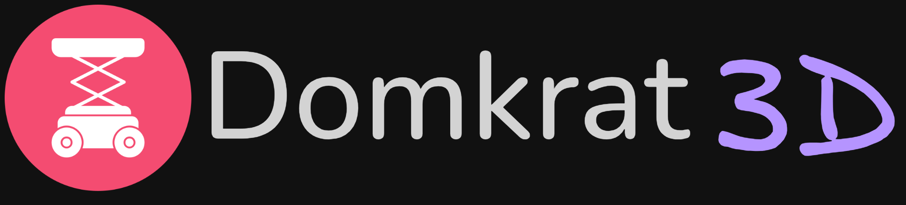
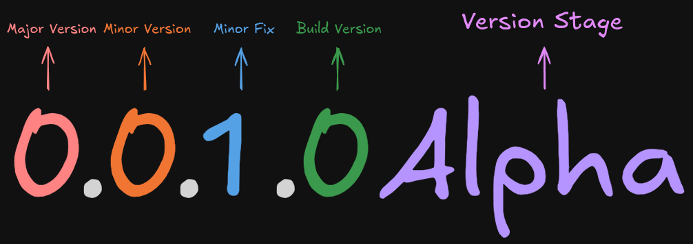
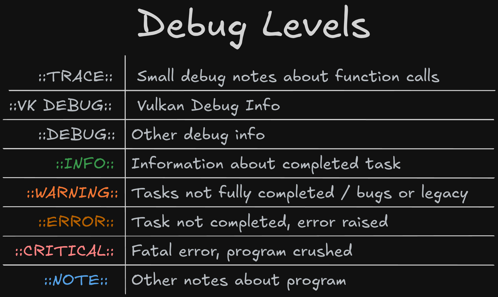

# ⚙️ domkrat3d
 

  
  

    DOMKRAT3D is a lightweight 3D engine in C++ & Vulkan
     
    <a href="https://alexeev-prog.github.io/domkrat3d/"><strong>Explore the docs »</strong></a>
     
     
    <a href="https://alexeev-prog.github.io/domkrat3d/">Documentation</a>
    ·
    <a href="https://github.com/alexeev-prog/domkrat3d/blob/main/LICENSE">License</a>
  

 

    
    
    
    
    
    
    

    
    

    

 > [!CAUTION]
 > At the moment, domkrat3d is under active development, many things may not work, and this version is not recommended for use (all at your own risk)

 > [!NOTE]
 > Building and installion: See the [BUILDING](BUILDING.md) document.

 > [!NOTE]
 > Contributing: See the [CONTRIBUTING](CONTRIBUTING.md) document.

 > [!NOTE]
 > Licensing: [GNU GPL V3](./LICENSE)

Welcome to Domkrat3D, a cutting-edge 3D game engine built on the robust C++ programming language and leveraging the Vulkan graphics API. If you're a game developer looking for flexibility, performance, and absolute control over your rendering pipeline, you’ve just found your new best friend. Let’s dive deeper! 💡

Our engine is easy-to-learn and lightweight. We use Vulkan - fast and popular graphic API.

## Versioning

## Why Choose Domkrat3D? 🛠️

- Performance-Focused: Built with performance as a top priority, Domkrat3D is optimized for speed and efficiency. With Vulkan as its backbone, expect lightning-fast render times and responsive gameplay.

- Modular Design: Our engine’s architecture allows for flexibility and scalability. Whether you’re creating a small indie game or a large-scale AAA title, Domkrat3D adapts to your needs, enabling you to plug in or update components as required.

- Intuitive API: We’ve designed a developer-friendly API that balances power and usability. With comprehensive documentation and examples, developers at any level can dive in and start building quickly.

- Community-Driven: Domkrat3D isn’t just an engine; it's a thriving community of passionate developers. Engage with others, share knowledge, and collaborate on bringing your game ideas to life. Join us and shape the future of gaming technology together! 🤝

- Cross-Disciplinary Support: Whether you're a programmer, artist, or designer, the ease of use and the integration capabilities of Domkrat3D make it easy for all team members to contribute effectively to the project.

## Why Vulkan? 🌌

### Unmatched Performance
Vulkan is the latest graphics API developed by the Khronos Group, providing low-level control over the GPU. This means you can squeeze out every last drop of performance from your hardware, unlocking visceral graphics and seamless gameplay experiences. With Vulkan, you get:

- Asynchronous Compute: Use your GPU's resources more efficiently by overlapping rendering and compute tasks.
- Explicit Control: Fine-tune your memory management and synchronization—Vulkan allows you to dictate how and when things render and resources are used, putting you in the driver’s seat.

### Cross-Platform Compatibility 🌍
Whether you're developing for Windows, Linux, or other platforms, Vulkan’s cross-platform support makes it an ideal choice for Domkrat3D. Reach a broader audience and ensure your game runs smoothly across various devices with minimal effort.

### Advanced Rendering Techniques
Vulkan supports advanced techniques such as tessellation, volumetric lighting, and more, allowing you to create visual masterpieces without the abstraction layers obstructing your vision. Elevate your game aesthetics to professional levels! 🎨

---

## Table of Contents

- [Introduction](#introduction)
- [Why Choose Domkrat3D?](#why-choose-domkrat3d)
- [How to use](#how-to-use)
  - [Examples](#examples)
- [Architecture Overview](#architecture-overview)
  - [Core Modules](#core-modules)
- [Dependencies & Libraries](#dependencies--libraries)
- [Engine Architecture](#engine-architecture)
- [Why Use Domkrat3D?](#why-use-domkrat3d)
- [Get Started](#ready-to-start)
- [Final Words](#final-words)
- [Join the Community](#join-the-community)
- [Thanks & Creator](#thanks--creator)

---

## Introduction

Welcome! ✨  
**Domkrat3D** is not just another 3D engine. It is the culmination of years spent developing a lightweight, fast, and highly modular framework built on Vulkan and modern C++17 standards. Designed for creators who value control, flexibility, and performance, Domkrat3D empowers you to build anything from rapid prototypes to fully-featured 3D games and simulations.

> 💬 **"I’ve always wanted an engine that launches instantly, gives ultimate control, and uses modern technologies."** — [Alexeev Bronislaw]

---

## Why Choose **Domkrat3D**? 🚀

| 🌟 Feature                | 🔍 Why It Matters                                                      |
|---------------------------|------------------------------------------------------------------------|
| ⚡️ Fast & Lightweight     | Minimizes load times and maximizes runtime efficiency.                 |
| 🧩 Modular Architecture   | Enables easy extension, customization, and integration of new features.|
| 🎮 Vulkan API Integration | Leverages cutting-edge graphics API for maximum rendering performance. |
| 📚 Modern C++17 Codebase  | Clean, maintainable, and future-proof code for professional workflows. |
| 🌍 Cross-Platform         | Runs seamlessly on Windows, Linux, and macOS.                          |

> [!NOTE]  
> Ensure your Vulkan and GPU drivers are up to date for optimal experience.

Domkrat 3D uses Vulkan version 1.4.

Major changes and additions in Vulkan 1.4:

1. added support for the Streaming Transfers mechanism, designed to enable the streaming of large amounts of data between the main system (host) and the graphics device without interrupting rendering or slowing down its performance. The mechanism is implemented using the new VK_EXT_host_image_copy extension, which is optional.;
2. performance-enhancing features have been upgraded to mandatory: Push Descriptors (the ability to write descriptor updates directly to the command buffer, instead of creating separate sets of descriptors and linking them to the command buffer), VK_KHR_dynamic_rendering_local_read (allows reading from nested buffers (attachments) and resources recorded by previous fragment shaders as part of dynamic rendering passes), VK_EXT_scalar_block_layout (allows using a C-like structure for SPIR-V blocks, in which non-scalar types can be aligned based on the size of their components);
3. The VK_KHR_maintenance5 and VK_KHR_maintenance6 extensions are included, providing auxiliary commands and structures to simplify resource and shader management.;
4. guaranteed support for rendering with a resolution of 8K (7680x4320 pixels) and using up to 8 independent rendering buffers.;
5. Many features that were previously optional have been made mandatory;
6. added a large portion of new commands and structures.

---

## How To Use
Please, build and install lib. [Instruction here](./BUILDING.md).

You also can read [Hacking](./HACKING.md)

### Examples
Here is some examples of C++ code for work with domkrat3d engine.

---

## Architecture Overview 🏗️
Domkrat3D’s architecture is thoughtfully segmented into specialized modules, making it easier to maintain, extend, and customize. Each module focuses on a specific domain of engine functionality.

### Debug levels
Domkrat3D have seven debug levels:

1. Trace - `::TRACE::`
2. Vulkan Debug - `::VK DEBUG::`
3. Debug - `::DEBUG::`
4. Info - `::INFO::`
5. Warning - `::WARNING::`
6. Error - `::ERROR::`
7. Critical - `::CRITICAL::`

### Engine Architecture at a Glance

| Module          | Description                                                                                                   | Roles & Key Features                                                                                  |
|-----------------|---------------------------------------------------------------------------------------------------------------|-------------------------------------------------------------------------------------------------------|
| **mathematics** | Mathematics module for calculating and solve equations                                                        | Calculate any needed data from algebra and geometry                                                   |

---

## Dependencies & Libraries 📦

Domkrat3D relies on a well-curated set of external libraries and tools to support its core functionality:

| Library                  | Purpose                                   | Explanation                                                                                |
|-------------------------|-------------------------------------------|------------------------------------------------------------------------------------------|
| **glfw**                | Window and Context Management             | Creates OS windows and handles input devices, essential for OpenGL context creation.     |
| **libGL**               | OpenGL Core Library                       | Provides OpenGL functionality, especially useful when a fallback is needed.              |
| **libGLU**              | OpenGL Utility Library                    | Provides additional functionalities for OpenGL, such as simplifying matrix and primitive operations. |
| **mesa**                | OpenGL Implementation                     | Useful for development and testing on OpenGL, especially on systems without hardware acceleration. |
| **glew**                | OpenGL Extension Wrangler                 | Helps manage OpenGL extensions, particularly important for compatibility.                 |
| **glm**                 | Math Library                             | Offers specialized vector and matrix operations optimized for graphics.                  |
| **stb**                 | Utility C Libraries for Images and Fonts | Popular single-header libraries for loading and working with images.                      |
| **entt**                | Entity-Component-System Library          | A lightweight and efficient ECS implementation for managing game entities.               |
| **cmake**               | Build System                             | The most widely used tool for cross-platform project build configuration.                |
| **gcc**                 | C++ Compiler                             | Required to build the engine and projects, providing numerous options and standard support. |
| **clang**               | Compiler and Code Analysis Tools          | A highly efficient compiler with powerful code analysis and diagnostics capabilities.      |
| **clang-tidy-sarif**   | Static Code Analysis Tool                 | Performs static code analysis to find potential errors before running the program.       |
| **clang-tools**         | Tools for Working with Clang              | A suite of tools aimed at improving code quality and automating development processes.   |
| **imgui**               | Immediate Mode GUI Library               | A simple yet powerful library for creating graphical user interfaces in applications.    |
| **freeglut**           | Alternative for Window and Input Handling  | A lightweight alternative for managing windows and input, often used in demo projects. |
| **portaudio**          | Audio Library                            | Provides user-friendly interfaces for working with audio devices.                         |
| **valgrind**           | Performance Analysis Tool                | Used for detecting memory leaks and profiling performance.                                |
| **gdb**                 | Debugger                                  | A tool for debugging programs, allowing the analysis of execution and error finding.     |
| **apitrace**           | API Tracing Tool                         | Enables tracking API calls in OpenGL, useful for debugging and performance analysis.     |
| **glava**              | OpenGL Performance Testing                | A utility designed for testing OpenGL performance and frame analysis.                    |
| **glui**               | GUI Library for OpenGL                   | Provides a set of tools for creating graphical user interfaces based on OpenGL.          |
| **glmark2**            | Performance Benchmark                     | Evaluates the performance of a system based on OpenGL, well-suited for graphics testing. |
| **glpng**              | PNG Library                               | Allows loading and processing PNG formatted images in graphics applications.               |
| **vulkan**             | Vulkan Library                            | Allows work with Vulkan API                                                                 |
| **validation layers** | Vulkan Layers Validations                  | Allow validations layers from Vulkan SDK LunarG                                             |
| **SDL2**              | SDL Library with submodules                | Allows use sound, pictures, and other.                                                       |

---

## Why Use **Domkrat3D**? ✨

- **Performance driven:** Vulkan-based backend harnesses full GPU power.
- **Extensible by design:** Modular, loosely coupled systems; add or replace features gracefully.  
- **Modern standards:** C++17 compliance ensures clean, maintainable, future-proof code.  
- **Cross-platform:** Write once, run on Windows, Linux, and macOS seamlessly.  
- **Built-in key systems:** Sound, physics, map loading, events right out of the box.

> [!TIP]  
> Start small with minimal core scenes, then progressively add physics, sound, and map support for manageable development cycles.

---

## Ready to Start? 🚦

Get building — prototyping or full game development — and enjoy a direct, no-nonsense toolchain centered on productivity and clarity.

---

## Final Words ✨

If you’re in need of:

- A lightning-fast and lightweight engine  
- Full Vulkan support  
- Modular and adaptable framework  
- Easy-to-understand architecture to fully control your project  

**Domkrat3D is the perfect fit.**

---

## Join the Community! 🌐

- **GitHub Issues** — for bug reporting and feature requests.  
- **Discord / Telegram** — for live chats and help (links forthcoming).  
- **Contact Email** — for direct feedback, suggestions, and collaboration inquiries.

---

Thank you for exploring **Domkrat3D** — let’s create extraordinary 3D experiences together! 🚀

